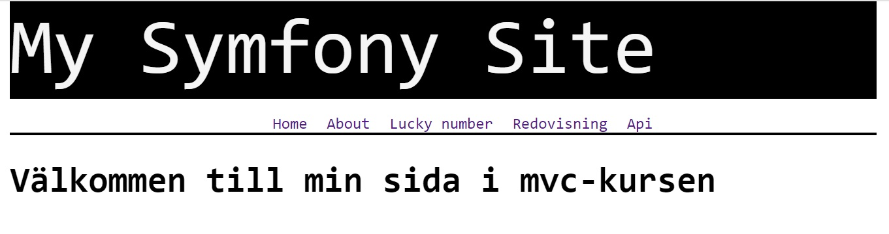

My repo README
========================

# About my repo

Symfony project for mvc course.

I chose to build a Blackjack game as my final project for the course. Check it out in the "Proj" section in the navbar.

Link to repo: https://github.com/Luciiidv/mvckurs

To start a server: php -S localhost:8888 -t public

To clone repo use command: 'git clone https://github.com/Luciiidv/mvckurs.git' in your terminal.

